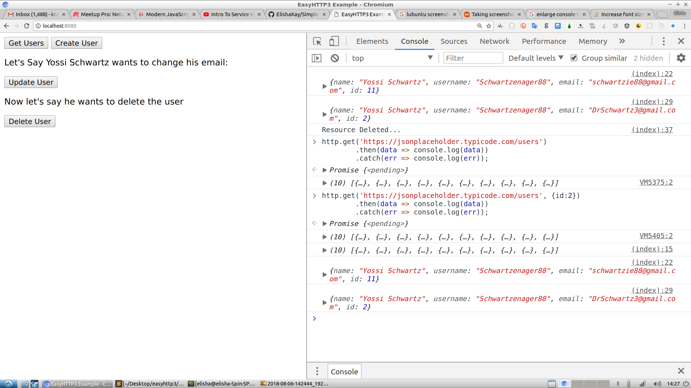

You can hear more about this library by watching the Douglas Traversy Course on ES6 on Udemy:

https://www.udemy.com/modern-javascript-from-the-beginning

Open your console and click some buttons for examples on how to use this simple http library.

